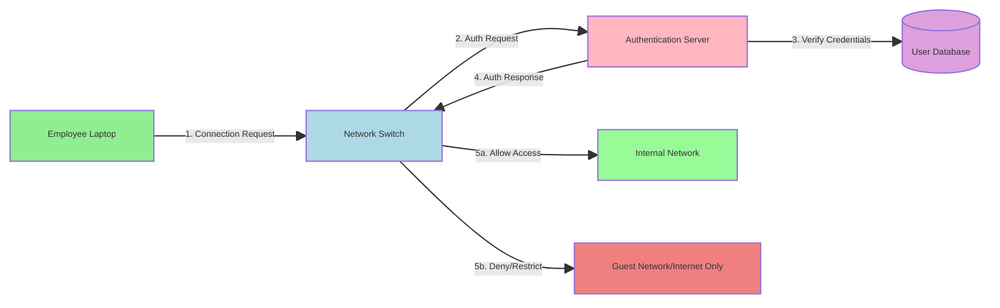

Extensible Authentication Protocol


-**目的**：EAPはネットワークにアクセスしようとするユーザとデバイスに、標準化のフレームワークを提供する。EAPは他のメカニズムと併用して初めてその仕組みが完成される。

-**特徴**:通常の認証方法ではユーザIDとパスワードで認証に限定に対し、EAPはIDとパスワードの認証をサポートしているが、その他の認証方法も多くサポートしている。

AuthenticatorとしてのSwitchやAPは、802.1X以外のすべてのトラフィックを遮断し、EAPパケットのみ許可するので、ネットワークのスピード向上と混雑回避にも寄与する。

EAPは他の認証方法でよくある、クライアントが認証プロセスを開始するとは違って、Authenticatorがクライアントに対して認証プロセスを開始するのが特徴。

### EAP-TLS
サーバとクライアント両方の証明書を検証してからコネクションを確立させるので、高度セキュリティが必要な環境に活用される
EAP Handshakeの流れ:
```
Client                              Server
   |                                   |
   |-------- Client Hello ------------>|
   |<------- Server Hello -------------|
   |<------- Server Certificate -------|
   |-------- Client Certificate ------>|
   |-------- Key Exchange ------------>|
   |<------- Session Establishment ----|
```