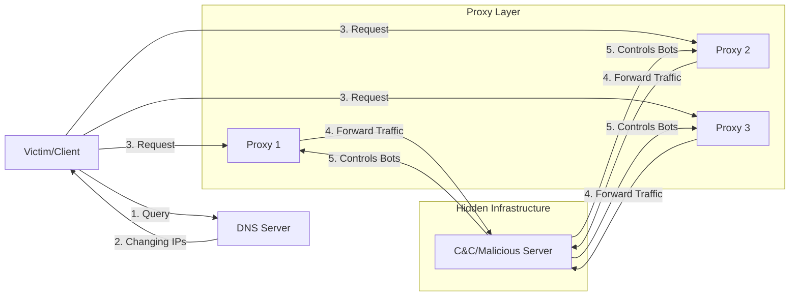

## 概要
Fast FluxはDNSとボットネットを利用し、悪意のあるアドレスへのIPアドレスを素早く変更することで、検知や遮断を回避する手法。

## 仕組み
1. 攻撃者が自分の用意した攻撃サーバへのアクセスを、多くの端末からなるボットネットにプロキシさせる。そしてそれらのプロキシのIPアドレスを、極端に短いTTLで攻撃サーバにリンクするようにDNSサーバに登録する。
   マルウェアなどによってコントロールされたクライアントがDNSサーバに攻撃サーバのアドレスを問い合わせする。
2. DNSがボットネット内のプロキシ中一つのアドレスをクライアントに回答する。
3. クライアントがそのプロキシアドレスにアクセス。
4. プロキシアドレスがアクセスを、攻撃サーバへリダイレクトする。

### C&Cサーバの役割
C&Cサーバはプロキシとなるボットネットの管理（可用性管理や指示を含む）や、DNSサーバへの登録などを行う。

## 特徴
Fast Fluxを利用する攻撃は：
1. ブロックすることが困難
2. 根本のサーバを取り締まることが困難
3. 調査、分析の複雑化
4. 可用性の強化
という特徴がある