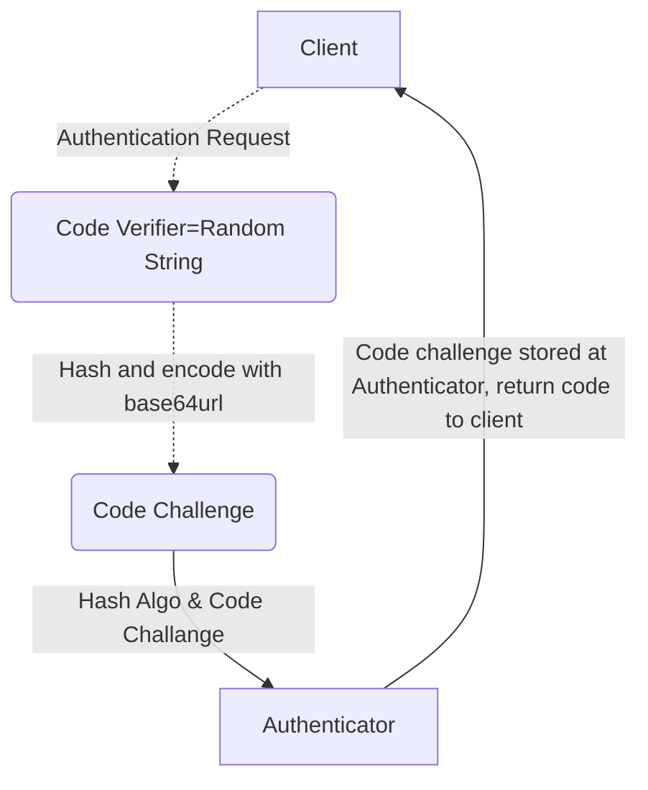
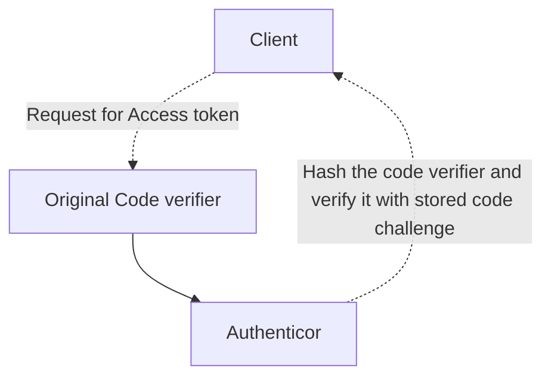

>[!NOTE]　PKCE におけるbase64urlエンコーディングの必要性
>PKCEでは仕様上(RFC 7636)、Code challengeを生成時、Code veriferをbase64urlでencodingすることを必須としている。
>その理由は、PKCEでコードチャレンジを送信時では、SHA-256などのハッシュアルゴリズムから得たハッシュ値のバイナリデータをHTTPのパラメータとして使用できなく、特に中の`+`や`/`などの符号はHTTPでは安全ではないので。
>Base64urlでバイナリデータをエンコードしてから送信する必要がある。

PKCEフロー（Proof Key for Code Exchange）について解説いたします。

PKCEは、OAuth 2.0の拡張機能で、主にパブリッククライアント（ブラウザベースのアプリケーションやモバイルアプリ）のセキュリティを向上させるために設計されました。

PKCEフローの主な手順は以下の通りです：

1. クライアントが認可リクエストを作成する際に、ランダムな文字列（code verifier）を生成します。

2. code verifierをハッシュ化して code challenge を作成します。

3. クライアントは認可リクエストに code challenge と使用したハッシュ方法を含めて送信します。

4. 認可サーバーは code challenge を保存し、通常の認可コードを返します。

5. クライアントがアクセストークンを要求する際、元の code verifier を含めて送信します。

7. 認可サーバーは受け取った code verifier をハッシュ化し、保存していた code challenge と比較して検証します。

この方法により、以下のセキュリティ上の利点があります：

- 認可コードの傍受攻撃を防ぐ
- クライアントの偽装を困難にする
- クライアントシークレットを使用せずに、クライアントを認証できる

PKCEは特に、クライアントシークレットを安全に保管できないモバイルアプリやシングルページアプリケーション（SPA）で重要です。

