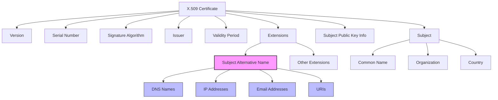

```mermaid
graph TD
    A[X.509 Certificate] --> B[Version]
    A --> C[Serial Number]
    A --> D[Signature Algorithm]
    A --> E[Issuer]
    A --> F[Validity Period]
    A --> G[Subject]
    A --> H[Subject Public Key Info]
    A --> I[Extensions]
    
    I --> J[Subject Alternative Name]
    I --> K[Other Extensions]
    
    J --> L[DNS Names]
    J --> M[IP Addresses]
    J --> N[Email Addresses]
    J --> O[URIs]
    
    G --> P[Common Name]
    G --> Q[Organization]
    G --> R[Country]
    
    style J fill:#f9f,stroke:#333,stroke-width:2px
    style L fill:#bbf,stroke:#333
    style M fill:#bbf,stroke:#333
    style N fill:#bbf,stroke:#333
    style O fill:#bbf,stroke:#333
```
