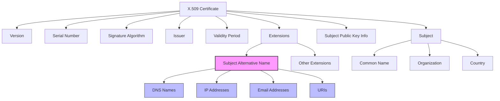

# Subject Alternative Name
The Subject Alternative Name (SAN) extension is a field within an X.509 certificate itself that contains identifiers (domain names, IP addresses, email addresses, URIs) for which the certificate is valid. When a client (like a web browser) connects to a server presenting a certificate, the client checks if the server's hostname matches any of the identifiers listed in the SAN extension of that certificate.